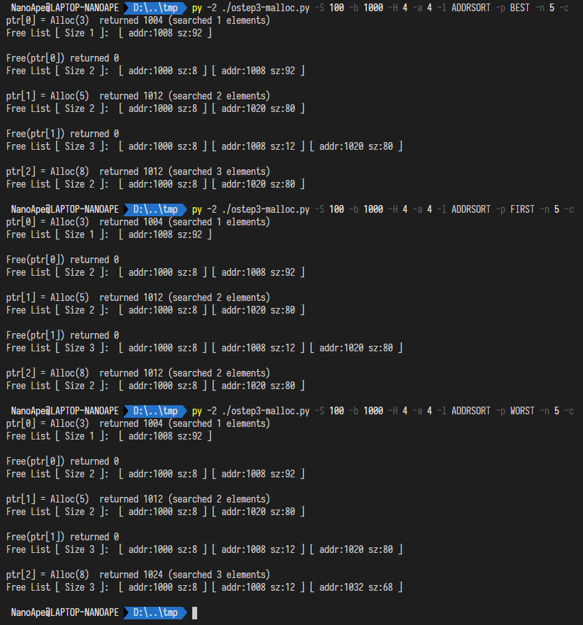

# Hw 4

- 分配 Size=8 的空间，现在 Free List 有 1 个 Free Block
- 释放 Size=8 的空间，现在 Free List 有 2 个 Free Block
- 分配 Size=12 的空间，最优匹配算法找到了不小于 12 的最小的 Free Block，即 addr=1008，现在 Free List 有 2 个 Free Block
- 释放 Size=12 的空间，现在 Free List 有 3 个 Free Block
- 分配 Size=12 的空间，最优匹配算法遍历找到了不小于 12 的最小的 Free Block，即 addr=1008，全部利用后现在 Free List 有 2 个 Free Block