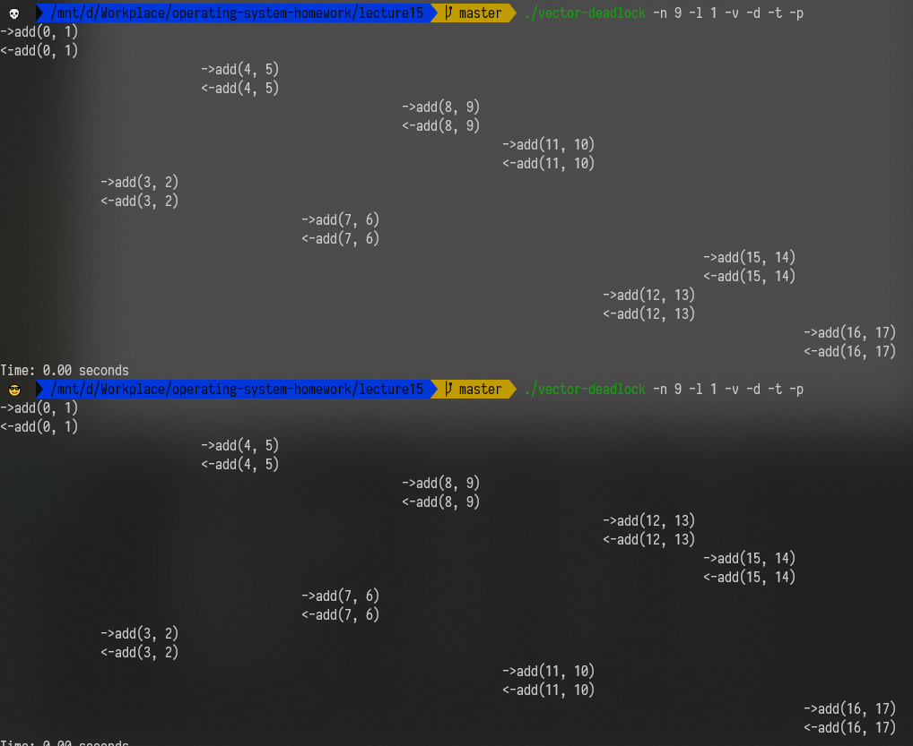

首先不能保证按顺序 `pthread_create` 出来的线程就能按顺序假如到 `scheduler` 里面，所以从一开始各个线程在各个 CPU 的队列中的顺序就是  

OS 运行时的诸多细节，例如某个线程 CPU 执行时间发生变化，或者中断，都会影响调度算法选择下一个执行的线程。调度器默认为 SCHED_OTHER 策略，即分时调度策略。调度器只能保证分配的时间和优先级有个大概的顺序，不能保证线程执行的顺序。

