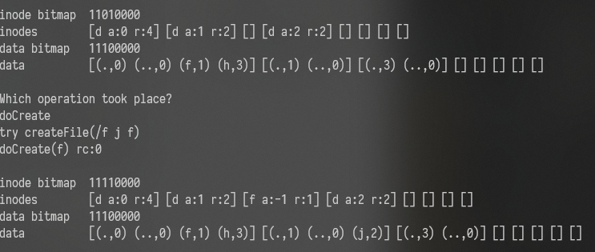

#### 分析索引节点 inode 和数据块（data-block）的采用的分配算法。

inode 和 data-block 都是按最先匹配算法分配的。

py 里面内置了一个 bitmap，每次需要新申请 inode 和 data-block 都是通过 bitmap.alloc 获取第一个零位的下标（即代表空间内按顺序第一个空闲的单位）

这里举一个例子：设置 `DEBUG` 为 `True` 后运行 ` ./vsfs.py -n 14 -s 18`，可以在输出中看到：

可以看见新建的 inode 的下标为 2，是第一个空闲的单位。